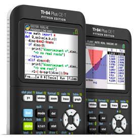
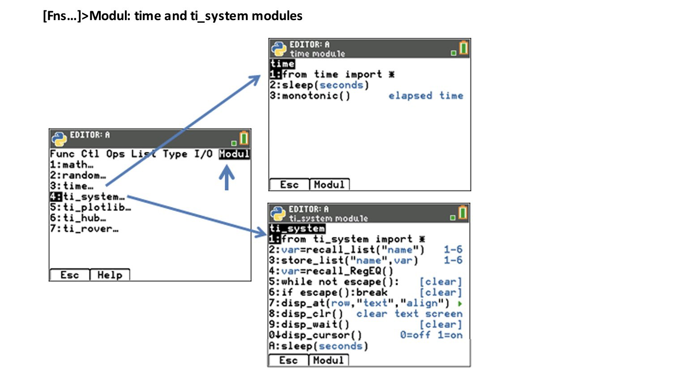
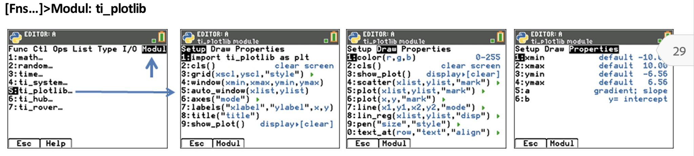

# Space Math

Space Math is a new educational program to discover **Space Equations** with the Scientific Calculator [TI-84 Plus CE-T Python Edition](https://education.ti.com/en-gb/products/calculators/graphing-calculators/ti-84-plus-ce-t-python)

The calculator allow coding in Micropython and includes the following Python modules provided by TI:

- [ti_system](https://education.ti.com/html/webhelp/EG_TI84PlusCE-T/ES/content/eg_pythonappprog/m_pygetstart/m_84ce-t_pyobapp.HTML#time_mod): Recall OS list and OS regression equation in a Python program. Create lists in a Python program and store to OS list variables. List length limit is 100 elements.

- [ti_plotlib](https://education.ti.com/html/webhelp/EG_TI84PlusCE-T/ES/content/eg_pythonappprog/m_pygetstart/m_84ce-t_pyobapp.HTML#ti_plotlib_mod): Run Python programs to render statistical and function plots.

- [ti_graphics](https://tiplanet.org/forum/viewtopic.php?t=23791&p=252807) Low level graphics module used by *ti_plotlib*

## References

- https://education.ti.com/html/webhelp/EG_TI84PlusCE-T/ES/content/eg_splash_page/ti-progpython.HTML
- https://circuitpython.org/
- https://spacemath.gsfc.nasa.gov/
