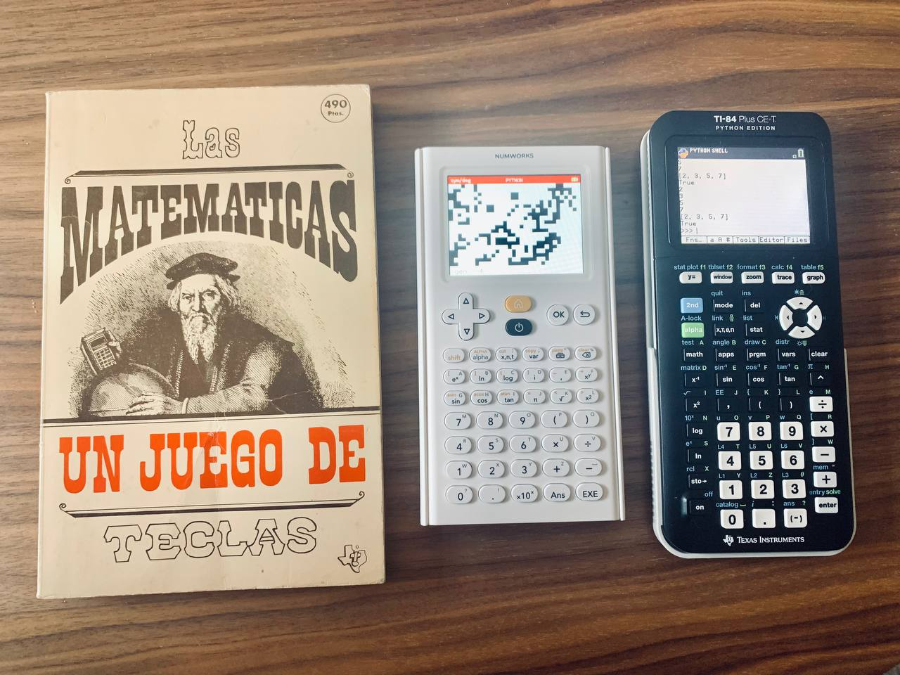
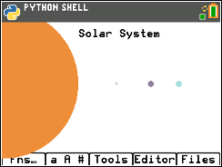
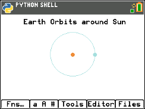
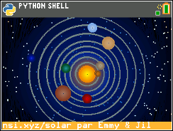
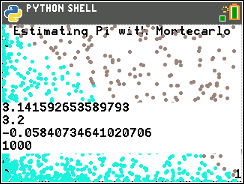
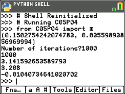
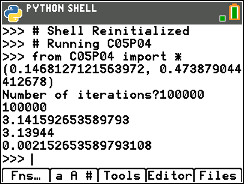
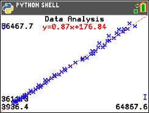

# Space Math

Space Math is a new educational program to discover **Space Equations** with the Scientific Calculator [TI-84 Plus CE-T Python Edition](https://education.ti.com/en-gb/products/calculators/graphing-calculators/ti-84-plus-ce-t-python) & [Numworks N0110](https://www.numworks.com/)

## Repository structure

The repository is organized in the chapters:

- [Chapter 1](ch01/): Hello World

- [Chapter 2](ch02/): First steps

- [Chapter 3](ch03/): Learning Micro Python
- [Chapter 4](ch04/): Solving Euler problems
- [Chapter 5](ch05/): Learning how to use *ti_plotlib* & *ti_graphics* modules

- [Chapter 6](ch06/): Solving Math problems

- [Chapter 7](ch07/): Learning how to use *ce_turtl* module

- [Chapter 8](ch08/): Analyzing data from Excel

- [Chapter 9](ch09/): Great Physics in the history
- [Chapter 10](ch10/): Branches of physics
- [Chapter 11](ch11/): Physical cosmology
- [Chapter 12](ch12/): Orbital mechanics

---

- [Chapter 99](ch99/): Device Limitations

---

## References

- https://education.ti.com/html/webhelp/EG_TI84PlusCE-T/ES/content/eg_splash_page/ti-progpython.HTML
- https://circuitpython.org/
- https://en.wikipedia.org/wiki/Turtle_graphics
- https://docs.python.org/3/library/turtle.html
- https://spacemath.gsfc.nasa.gov/
- https://replit.com/languages/python3

## Forums

- https://www.cemetech.net/forum/viewforum.php?f=45
- https://tiplanet.org/forum/viewforum.php?f=116

## Other links

- https://my.numworks.com/python/jabrena
