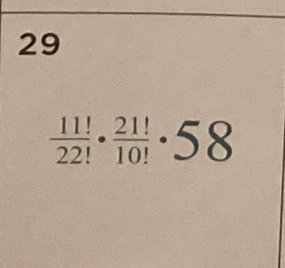

# Daily Math

In this folder, I will try to solve Math problems from:

- https://twitter.com/GWOMaths

## 2021/12/31


```
jbang Problem20211231.java
```

## 2021/12/29



```
jbang Problem20211229.java
```

## 2021/12/28


```
jbang Problem20211228.java
```

## 2021/12/27


```
jbang Problem20211227.java
```

## 2021/12/26


```
jbang Problem20211226.java
```

## 2021/12/24


```
jbang Problem20211224.java
```

## How to install Jbang?

```
sdk install jbang
```

## Testing Jbang

```
jbang HelloWorld.java
```

```
curl \
  -H "Accept: application/vnd.github.v3+json" \
  https://api.github.com/search?l=Java&q="import+lombok."&type=Code
```