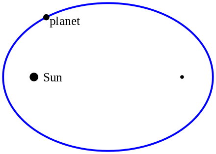
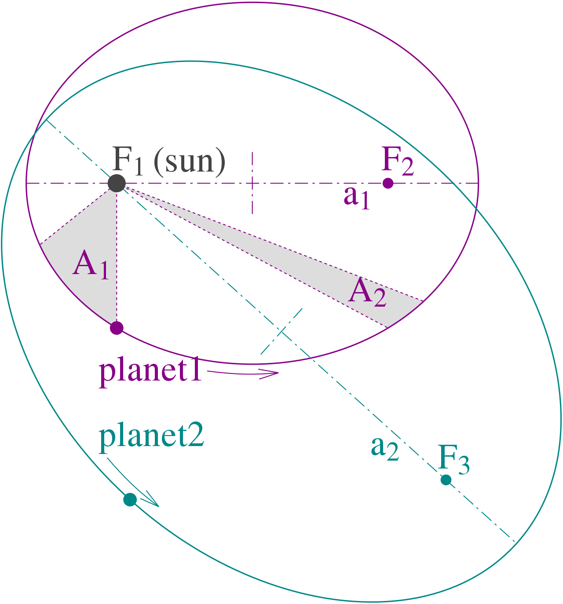

# Johannes Kepler

## Kepler's laws of planetary motion

- The orbit of a planet is an ellipse with the Sun at one of the two foci.

- A line segment joining a planet and the Sun sweeps out equal areas during equal intervals of time.

- The square of a planet's orbital period is proportional to the cube of the length of the semi-major axis of its orbit.

## References

- https://en.wikipedia.org/wiki/Johannes_Kepler
- https://en.wikipedia.org/wiki/Platonic_solid
- https://en.wikipedia.org/wiki/Kepler%27s_laws_of_planetary_motion

