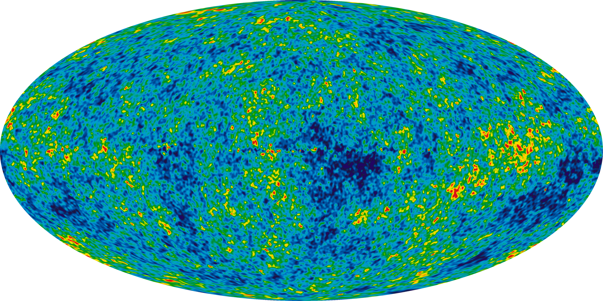

# Physical cosmology

Physical cosmology is the study of the universe's origin, its large-scale structures and dynamics, and the ultimate fate of the universe, including the laws of science that govern these areas.

## References

- https://en.wikipedia.org/wiki/Physical_cosmology
- https://en.wikipedia.org/wiki/Lambda-CDM_model
- https://en.wikipedia.org/wiki/Cosmology
