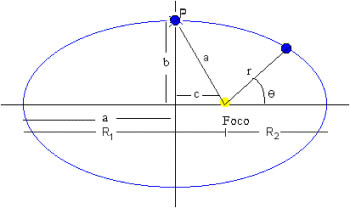

# Problem 1

The Earth's orbit is an ellipse and one of its focus is the Sun.

If the semi-major axis of the orbit measures 148.5 million kilometers and knowing that the eccentricity of the orbit is 1/62, obtain the minimum and maximum distance.

## Formulas

**Eccentricity:**

The eccentricity of an ellipse is, most simply, the ratio of the distance c between the center of the ellipse and each focus to the length of the semimajor axis a.

## References

- https://en.wikipedia.org/wiki/Eccentricity_(mathematics)#Ellipses
- https://latex.codecogs.com/

