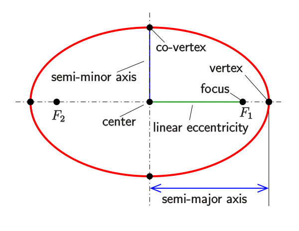

# Problem 2

Calculate the equation of an ellipse with foci at (-3,2) and (3, -4) and the major axis is equal to 10

## Formulas

**Distance between 2 points:**

%20=%20%5Csqrt%7B(x2%20-%20x1)%5E%7B2%7D%20&plus;%20(y2%20-y1)%5E%7B2%7D%7D%20)

- d(P1, P2) = \sqrt{(x2 - x1)^{2} + (y2 -y1)^{2}}

## References

- https://en.wikipedia.org/wiki/Ellipse
- https://latex.codecogs.com/
