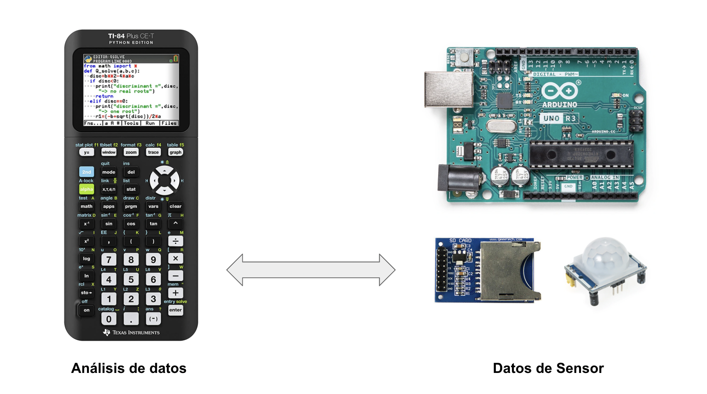

# Arquitectura para el año 1

Solución diseñada para el curso 2021-2022.

## Planificación 2021-2022

- De Octubre a Enero: Aprender a desarrollar programas en la calculadora con MicroPython.
- De Enero a Junio: Aprender a usar Arduino para capturar datos de sensores que seran procesados en la calculadora.
