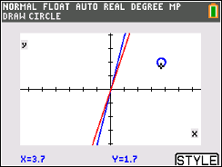
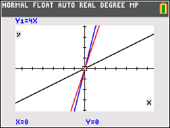

# Diciembre 2021

## 1/12/2021

- Proyecto Científico V
- Fisica: Isaac Newton
- Matemaáticas: TI-84 CE Python -> Graficos

Preguntas para la siguiente clase:

- Agujeros negros en la via lactea
- Ecuaciones en la naturaleza.
