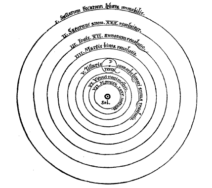

# Octubre 2021

## 13/10/2021

- Proyecto Científico
- Fisica: Sistema Solar
- Programación: Micro Python

### Proyecto Cientifico

```
Piensa en una idea que pueda subir al espacio y operar de manera autonoma.

Tienes 3 años para montar un prototipo.
```

### Fisica: Sistema Solar

- ¿Que Sabes del sistema solar?
- ¿A que distancia estan los distintos planetas con respecto al Sol?
- ¿Que pensaba Ptolomeo con respecto al Universo?

### Programación: Micro Python

- Abrir Gitpod

[](https://gitpod.io/#https://github.com/jabrena/space-math)

- Navegar con el terminal de VSCode
- Ejecutar Python desde el terminal

**Introducción a la programación:**

- https://www.youtube.com/watch?v=GyychYJh7yo&ab_channel=Generaci%C3%B3nCode
- https://www.youtube.com/watch?v=6ORfm71KcUY&ab_channel=LEGOEducation
- https://www.youtube.com/watch?v=9y1jwE0Qa4Y&ab_channel=LEGOEducation

**Micro Python:**

Puntos a tratar:

- Hello World
- Data Types
- Comments
- Bifurcation
- Iteration
- Functions
- Classes
- Import

**Problemas de programación**

## 20/10/2021

- Proyecto Científico II
- Fisica: Modelo de Ptolomeo
- Programación: Micro Python II

### Proyecto Cientifico

### Fisica: Sistema Solar

- ¿Que Sabes del sistema solar?
- ¿A que distancia estan los distintos planetas con respecto al Sol?

1 UA es igual a cerca de 150 millones de km

```
Planeta	    Distancia Promedio desde el Sol (UA)
Mercurio	0.39
Venus	    0.72
Tierra	    1.00
Marte	    1.52
Júpiter	    5.20
Saturno	    9.54
Urano	    19.22
Neptuno	    30.06
```

- ¿Que pensaba Ptolomeo con respecto al Universo?

https://es.wikipedia.org/wiki/Teor%C3%ADa_geoc%C3%A9ntrica

85 AC

La teoría geocéntrica (también llamada modelo geocéntrico, geocentrismo o modelo ptolemaico) es una teoría astronómica que sitúa a la Tierra en el centro del universo, y a los astros, incluido el Sol, girando alrededor de la Tierra (geo: Tierra; centrismo: agrupado o de centro).

- ¿Cual es el modelo de Nicolás Copérnico?

### Programación: Micro Python

**Introducción a la programación:**

**Micro Python II:**

Puntos a tratar:

- Data Types
- Comments
- Bifurcation
- Iteration
- Functions
- Classes
- Import

### Challenges Pendientes

- Escribe un programa que pinte en pantalla todos los miembros de tu familia.

### Challenges

- Escribe un programa que si le pasas las edades de los miembros de tu familia, diga si es mayor de edad o no
- Escribe un programa que pinte los miembros de tu familia en pantalla, pero empleando una estructura de datos como un Vector.
- Escribe la tabla de multiplicar del 5

### Comandos de Linux

- cd
- ls
- python
- cat 

## 27/10/2021

- Proyecto Científico III
- Fisica: Nicolas Copernico
- Programación: Micro Python III

### Proyecto Cientifico

### Fisica: Nicolas Copernico

- ¿Cual fue la innovacion de Galileo?

Copérnico está considerado como el precursor de la astronomía moderna, aportando las bases que permitieron a Newton culminar la revolución astronómica, al pasar de un universo geocéntrico a un cosmos heliocéntrico y cambiando irreversiblemente la mirada del cosmos que había prevalecido hasta entonces.

https://es.wikipedia.org/wiki/Nicol%C3%A1s_Cop%C3%A9rnico



### Programación: Micro Python

**Introducción a la programación:**

**Micro Python II:**

- Comments
- Bifurcation
- Iteration
- Functions
- Classes
- Import

### Challenges

- Escribe un programa que si le pasas las edades de los miembros de tu familia, diga si es mayor de edad o no
- Escribe un programa que pinte los miembros de tu familia en pantalla, pero empleando una estructura de datos como un Vector.
- Escribe la tabla de multiplicar del 5
