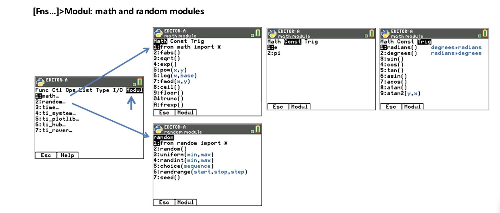

# TI Modules

The calculator allow coding in Micropython and includes the following Python modules provided by TI:

- [math](https://education.ti.com/html/webhelp/EG_TI84PlusCE-T/ES/content/eg_pythonappprog/m_pygetstart/m_84ce-t_pyobapp.HTML#math_mod): Math operations.

- [ti_system](https://education.ti.com/html/webhelp/EG_TI84PlusCE-T/ES/content/eg_pythonappprog/m_pygetstart/m_84ce-t_pyobapp.HTML#time_mod): Recall OS list and OS regression equation in a Python program. Create lists in a Python program and store to OS list variables. List length limit is 100 elements.

- [ti_plotlib](https://education.ti.com/html/webhelp/EG_TI84PlusCE-T/ES/content/eg_pythonappprog/m_pygetstart/m_84ce-t_pyobapp.HTML#ti_plotlib_mod): Run Python programs to render statistical and function plots.

- [ti_graphics](https://tiplanet.org/forum/viewtopic.php?t=23791&p=252807) Low level graphics module used by *ti_plotlib*

## Third party modules

- [ce_turtl](https://resources.tistemprojects.com/tistemprojects-home?resource_id=3115&cHash=e13bea203ea4ca8b9f6dfacb519bf2be) Turtle Graphics module for TI-84 Plus CE-T Python Edition
